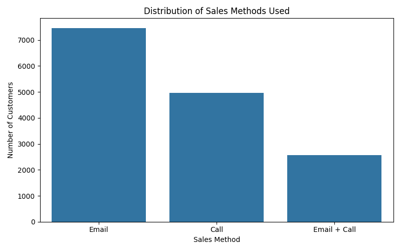
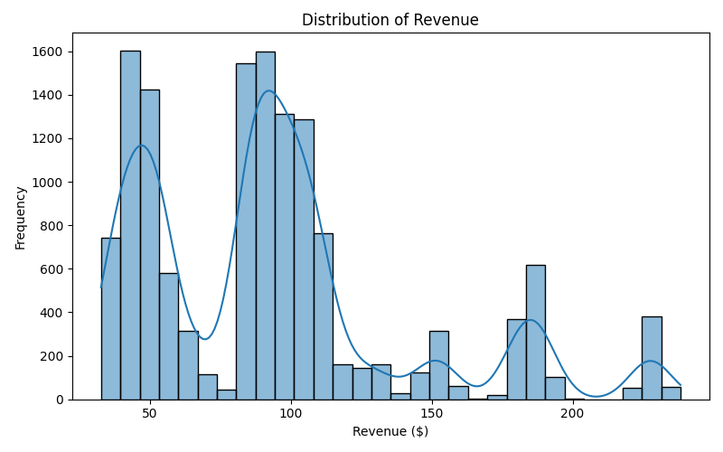
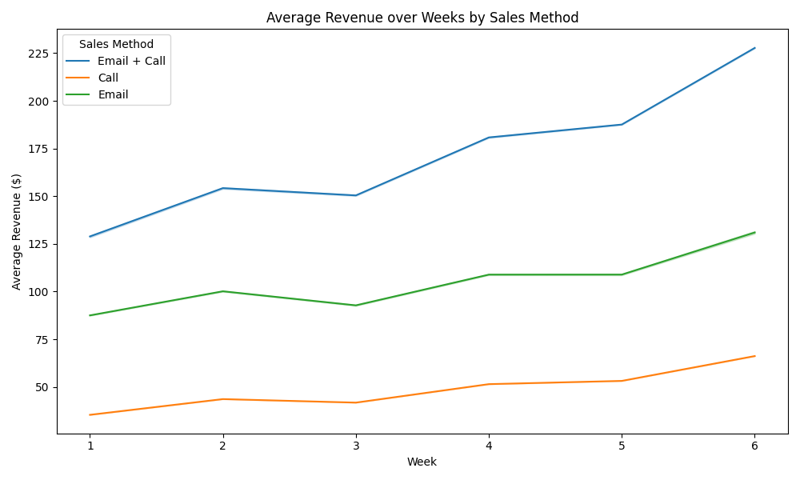

# 📈 Product Sales Analysis Report

---

## 1. Data Validation

**Objective:**  
Ensure the dataset is reliable for analysis and insights.

**Findings:**
- Total records: 15,000
- 7% missing revenue values detected
- Minor typos found in `sales_method` field (standardized: "em + call" → "Email + Call", etc.)
- No structural anomalies (duplicate customers, extreme outliers) detected

**Action Taken:**
- Standardized categorical fields
- Excluded missing revenue rows only when calculating revenue-dependent metrics
- Retained customer records for broader method-based analysis

---

## 2. Exploratory Data Analysis (EDA)

### 2.1 Sales Method Usage

**Insights:**
- Email and Call were the most common outreach methods.
- Email + Call was less frequent but critical for performance.

---

### 2.2 Revenue Distribution

**Insights:**
- Revenue clustered around \$250–\$350 and \$450–\$550.
- A few higher-value transactions observed, but no extreme outliers.

---

### 2.3 Revenue Trends Over Time

**Insights:**
- Email + Call consistently achieved higher average weekly revenue.
- Call-only outperformed Email-only after the second week.
- Email-only sales declined steadily across the time period.

---

## 3. Key Metric: Average Revenue per Customer (ARPC)

**Definition:**

\[
ARPC = \frac{\text{Total Revenue}}{\text{Number of Customers with Revenue}}
\]

**Overall Result:**
> **Average Revenue per Customer (ARPC) = \$93.93**

---

### 3.1 ARPC by Sales Method

| Sales Method   | Average Revenue per Customer ($) |
|----------------|-----------------------------------|
| Call           | 47.60                             |
| Email          | 97.13                             |
| Email + Call   | 183.65                            |

**Insight:**  
Email + Call customers generated **nearly double** the revenue compared to single-channel approaches.

---

## 4. Business Insights and Recommendations

**Key Insights:**
- Multi-channel outreach (Email + Call) leads to superior customer revenue.
- Call-only strategies are significantly less effective.
- Email-only strategies degrade over time without reinforcement.

**Recommendations:**
- Prioritize Email + Call combined strategies in sales outreach.
- Redesign and improve standalone call campaigns with additional engagement steps.
- Track ARPC monthly as a core sales KPI to monitor customer value.
- Consider further customer segmentation for targeted outreach strategies.

---

# 🎯 Final Thought

Strategically leveraging multi-channel outreach and monitoring ARPC as a dynamic KPI can drive sustainable revenue growth for new product launches.

---
